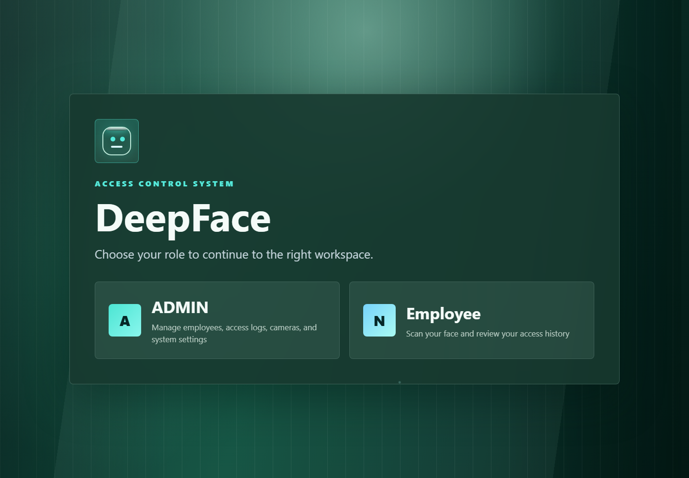
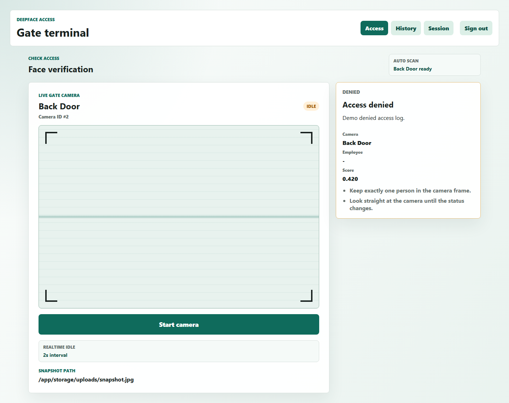
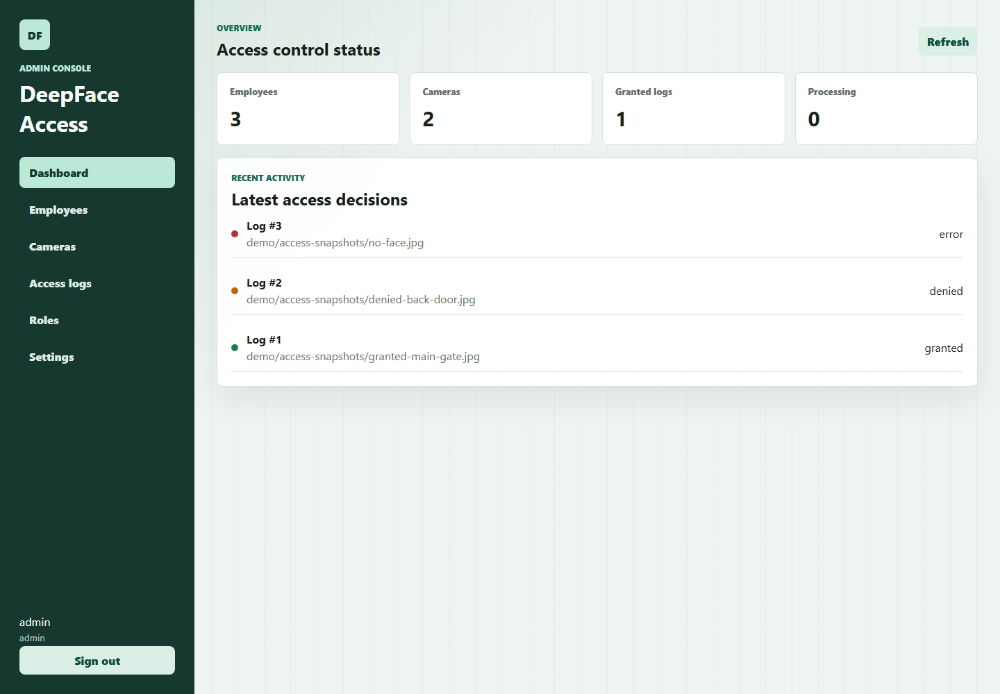

<p align="center">
  
</p>

<div align="center">

**Hệ thống kiểm soát ra vào bằng nhận diện khuôn mặt, triển khai theo kiến trúc full-stack nhiều service với Frontend, Backend API, AI Worker, PostgreSQL, Redis, MinIO, Qdrant, Nginx và monitoring.**

<br>


<br><br>


<br><br>

<a href="#tổng-quan">Tổng quan</a>
<span> • </span>
<a href="#giao-diện-demo">Giao diện</a>
<span> • </span>
<a href="#điểm-nhấn-sản-phẩm">Điểm nhấn</a>
<span> • </span>
<a href="#kiến-trúc">Kiến trúc</a>
<span> • </span>
<a href="#chạy-nhanh">Chạy nhanh</a>
<span> • </span>
<a href="#api-chính">API</a>
<span> • </span>
<a href="#kiểm-thử">Kiểm thử</a>
<span> • </span>
<a href="#ghi-chú-production">Production</a>

</div>

---

<table>
  <tr>
    <td align="center" width="25%">
      
      <br>
      <strong>Home, User, Admin</strong>
      <br>
      <sub>Tách rõ trải nghiệm người dùng và quản trị.</sub>
    </td>
    <td align="center" width="25%">
      
      <br>
      <strong>Xử lý nền</strong>
      <br>
      <sub>Embedding và matching không khóa request API.</sub>
    </td>
    <td align="center" width="25%">
      
      <br>
      <strong>DB, Object, Vector</strong>
      <br>
      <sub>PostgreSQL, MinIO và Qdrant đúng yêu cầu đề bài.</sub>
    </td>
    <td align="center" width="25%">
      
      <br>
      <strong>Quan sát vận hành</strong>
      <br>
      <sub>Prometheus, Grafana, Alertmanager và health checks.</sub>
    </td>
  </tr>
</table>

## Tổng Quan

`DeepFace Access Control` là MVP cho use case **kiểm soát ra vào công ty, phòng lab hoặc ký túc xá bằng nhận diện khuôn mặt**. Hệ thống không chỉ là một script AI đơn lẻ mà được tách thành các service có vai trò rõ ràng:

- **User Terminal** cho người dùng upload hoặc chụp snapshot để kiểm tra quyền ra vào.
- **Admin Console** cho quản trị viên quản lý nhân viên, camera, user, ảnh enrollment và access logs.
- **FastAPI Backend** xử lý auth, nghiệp vụ, upload ảnh, tạo log và đẩy job vào queue.
- **AI Worker** chạy DeepFace, tạo embedding, so khớp vector và cập nhật kết quả truy cập.
- **PostgreSQL, Redis, MinIO, Qdrant** đáp ứng các lớp lưu trữ bắt buộc của đề bài.
- **Nginx, Prometheus, Grafana, Alertmanager** phục vụ gateway và quan sát vận hành.

## Checklist Đáp Ứng Đề Bài

| Yêu cầu | Trạng thái | Minh chứng trong repo |
| --- | --- | --- |
| Use case rõ ràng |  | Kiểm soát ra vào bằng nhận diện khuôn mặt |
| Frontend người dùng |  | `frontend/user` |
| Frontend quản trị |  | `frontend/admin` |
| Backend API |  | `backend/app` |
| Database |  | PostgreSQL service `database` |
| Object storage |  | MinIO service `minio` |
| Vector database |  | Qdrant service `qdrant` |
| Queue / worker nền |  | Redis queue + `worker/app/tasks` |
| Load balancer / reverse proxy |  | `nginx/nginx.conf` |
| Docker Compose |  | `docker-compose.yml` |
| README hướng dẫn chạy |  | File này |
| CI/CD |  | `.github/workflows/ci.yml` |
| Monitoring |  | `monitoring/prometheus`, `monitoring/grafana` |
| Helm chart |  | `helm/deepface-access` |
| Backup script |  | `scripts/backup.ps1`, `scripts/backup-s3.ps1` |

## Phân Công Và Phối Hợp Nhóm

Nhóm phân công theo bốn module chính: **Backend/API**, **AI/Worker**,
**Frontend** và **DevOps/Docs/QA**. Mỗi thành viên chịu trách nhiệm chính cho
một module, đồng thời cùng tích hợp và kiểm thử các điểm giao nhau trong luồng
end-to-end của hệ thống:

```text
Frontend -> Backend API -> Redis Queue -> AI Worker -> PostgreSQL / MinIO / Qdrant
```


Chi tiết phân công, phạm vi phối hợp và nguyên tắc hỗ trợ trả lời khi bảo vệ:
[`docs/team-roles.md`](docs/team-roles.md).

## Điểm Nhấn Sản Phẩm

<table>
  <tr>
    <td width="33%">
      
      <br><br>
      <strong>Luồng dùng rõ theo vai trò</strong>
      <br>
      <sub>Người dùng chỉ thấy terminal kiểm tra ra vào; admin có dashboard riêng để quản lý nhân viên, camera, user và log.</sub>
    </td>
    <td width="33%">
      
      <br><br>
      <strong>Backend nhẹ, worker xử lý nặng</strong>
      <br>
      <sub>API chỉ tạo job và trả trạng thái ban đầu; DeepFace chạy trong worker để hệ thống dễ mở rộng hơn.</sub>
    </td>
    <td width="33%">
      
      <br><br>
      <strong>So khớp bằng vector database</strong>
      <br>
      <sub>Embedding khuôn mặt được index vào Qdrant, còn PostgreSQL vẫn giữ dữ liệu nghiệp vụ chính.</sub>
    </td>
  </tr>
  <tr>
    <td width="33%">
      
      <br><br>
      <strong>Ảnh lưu theo object storage</strong>
      <br>
      <sub>Ảnh enrollment và snapshot access được lưu trong MinIO thay vì nhét trực tiếp vào database.</sub>
    </td>
    <td width="33%">
      
      <br><br>
      <strong>Có lớp vận hành</strong>
      <br>
      <sub>Health check, metrics, Grafana dashboard và Alertmanager giúp demo giống hệ thống thực tế hơn.</sub>
    </td>
    <td width="33%">
      
      <br><br>
      <strong>Có đường lên production</strong>
      <br>
      <sub>GitHub Actions build/test/push image; Helm chart là baseline cho triển khai Kubernetes.</sub>
    </td>
  </tr>
</table>

## Giao Diện Demo

<p align="center">
  
</p>

<table>
  <tr>
    <td align="center" width="50%">
      <strong>User Access Terminal</strong>
      <br>
      <sub>Gửi snapshot, chọn camera, xem trạng thái xử lý và lịch sử ra vào.</sub>
    </td>
    <td align="center" width="50%">
      <strong>Admin Control Dashboard</strong>
      <br>
      <sub>Quản lý employees, cameras, users, enrollment và access logs.</sub>
    </td>
  </tr>
  <tr>
    <td></td>
    <td></td>
  </tr>
</table>

## Kiến Trúc

```mermaid
%%{init: {"theme":"base","themeVariables":{"fontFamily":"Arial","background":"#F8FAFC","primaryColor":"#EFF6FF","primaryTextColor":"#0F172A","primaryBorderColor":"#2563EB","lineColor":"#64748B","secondaryColor":"#F8FAFC","tertiaryColor":"#F1F5F9","clusterBkg":"#F8FAFC","clusterBorder":"#CBD5E1"}}}%%
flowchart TB
    browser["User / Admin Browser"]
    nginx["Nginx Gateway<br/>:8080"]

    subgraph presentation["Presentation Layer"]
        direction LR
        home["Home UI<br/>frontend-home"]
        user["User Terminal<br/>frontend-user"]
        admin["Admin Console<br/>frontend-admin"]
    end

    backend["FastAPI Backend<br/>auth, CRUD, upload,<br/>queue, metrics"]

    subgraph storage["Storage & Messaging"]
        direction TB
        redis[("Redis Queue<br/>embedding_jobs,<br/>access_jobs")]
        pg[("PostgreSQL<br/>users, employees, logs")]
        minio[("MinIO<br/>face images, snapshots")]
        qdrant[("Qdrant<br/>face vectors")]
        redis ~~~ pg
        redis ~~~ minio
        redis ~~~ qdrant
    end

    monitor["Prometheus + Grafana<br/>metrics dashboard"]
    worker["AI Worker<br/>DeepFace embedding +<br/>matching"]

    browser --> nginx
    nginx --> home
    nginx --> user
    nginx --> admin
    nginx --> backend

    backend --> redis
    backend --> pg
    backend --> minio
    backend --> monitor

    redis --> worker
    worker --> pg
    worker --> minio
    worker --> qdrant

    classDef browserStyle fill:#EFF6FF,stroke:#2563EB,color:#0F172A,stroke-width:2px;
    classDef gatewayStyle fill:#EEF2FF,stroke:#4F46E5,color:#0F172A,stroke-width:2px;
    classDef uiStyle fill:#F0F9FF,stroke:#0284C7,color:#0F172A,stroke-width:2px;
    classDef backendStyle fill:#ECFDF5,stroke:#059669,color:#0F172A,stroke-width:2px;
    classDef storageStyle fill:#FFFBEB,stroke:#D97706,color:#0F172A,stroke-width:2px;
    classDef workerStyle fill:#FFF1F2,stroke:#E11D48,color:#0F172A,stroke-width:2px;
    classDef monitorStyle fill:#F8FAFC,stroke:#475569,color:#0F172A,stroke-width:2px;

    class browser browserStyle;
    class nginx gatewayStyle;
    class home,user,admin uiStyle;
    class backend backendStyle;
    class redis,pg,minio,qdrant storageStyle;
    class worker workerStyle;
    class monitor monitorStyle;

    style presentation fill:#F8FAFC,stroke:#CBD5E1,color:#0F172A
    style storage fill:#FFFBEB,stroke:#FCD34D,color:#0F172A
```



### Service Chính

| Service | Vai trò | Công nghệ |
| --- | --- | --- |
| `frontend-home` | Trang chọn vai trò | Static HTML, Nginx |
| `frontend-user` | Terminal kiểm tra truy cập | React, Vite, Nginx |
| `frontend-admin` | Dashboard quản trị | React, Vite, Nginx |
| `backend` | API nghiệp vụ, auth, upload, queue, metrics | FastAPI, SQLAlchemy |
| `worker` | Xử lý AI nền | DeepFace, Python |
| `database` | Source of truth | PostgreSQL 16 |
| `redis` | Message queue | Redis 7 |
| `minio` | Object storage | S3-compatible storage |
| `qdrant` | Vector database | Qdrant |
| `nginx` | Gateway / reverse proxy | Nginx |
| `prometheus` | Thu thập metrics | Prometheus |
| `grafana` | Dashboard monitoring | Grafana |
| `alertmanager` | Alert routing baseline | Alertmanager |
| `db-seed` | Tạo bảng và tài khoản demo | Python one-shot job |
| `cron-backup` | Backup S3 định kỳ, tùy chọn | Cần bổ sung context `backup/cron` nếu muốn chạy service này |

## Luồng Nghiệp Vụ

### 1. Enrollment Khuôn Mặt

| Bước | Mô tả |
| --- | --- |
|  | Admin tạo employee trong Admin Console. |
|  | Admin upload ảnh khuôn mặt cho employee. |
|  | Backend validate ảnh, lưu object vào MinIO và tạo job trong Redis queue `embedding_jobs`. |
|  | Worker lấy job, chạy DeepFace để tạo embedding. |
|  | Worker lưu embedding metadata vào PostgreSQL và upsert vector vào Qdrant. |

### 2. Kiểm Tra Ra Vào

| Bước | Mô tả |
| --- | --- |
|  | User chọn camera và upload/chụp snapshot tại User Terminal. |
|  | Backend lưu snapshot vào MinIO, tạo access log trạng thái `processing`. |
|  | Backend đẩy job vào Redis queue `access_jobs`. |
|  | Worker tạo embedding cho snapshot, truy vấn Qdrant để tìm khuôn mặt gần nhất. |
|  | Worker cập nhật access log thành `granted`, `denied` hoặc `error`. |
|  | Frontend hiển thị kết quả cho người dùng. |

## Chạy Nhanh

### Yêu Cầu

- Docker Desktop đang chạy.
- Docker Compose v2.
- Windows PowerShell nếu chạy theo lệnh mẫu bên dưới.
- Lần đầu chạy worker có thể lâu vì DeepFace cần tải hoặc khởi tạo model weights.

### 1. Clone Và Tạo Env

```powershell
git clone https://github.com/trunguet/2526-THPTHTTTNT-DeepFace.git
cd 2526-THPTHTTTNT-DeepFace
Copy-Item .env.example .env
```

File `.env.example` đang để trống để Compose dùng các giá trị mặc định an toàn cho demo local. Chỉ sửa `.env` nếu cần đổi secret, tài khoản seed, model hoặc port monitoring.

### 2. Chạy Core Demo Stack

Repo hiện có service `cron-backup` là phần backup định kỳ tùy chọn. Để chạy demo chính và tránh phụ thuộc phần backup cron, dùng danh sách service core dưới đây:

```powershell
$coreServices = @(
  "database", "redis", "minio", "qdrant",
  "db-seed", "backend", "worker",
  "frontend-home", "frontend-user", "frontend-admin",
  "nginx", "prometheus", "alertmanager", "grafana"
)

docker compose up --build -d $coreServices
```

Nếu nhóm đã bổ sung đầy đủ context cho `cron-backup`, có thể chạy full compose:

```powershell
docker compose up --build -d
```

### 3. Kiểm Tra Sau Khi Chạy

```powershell
docker compose ps
.\scripts\demo-baseline-check.ps1
```

Nếu chỉ muốn kiểm tra file và cấu hình mà không cần runtime:

```powershell
.\scripts\demo-baseline-check.ps1 -StaticOnly
```

### 4. Dừng Hệ Thống

```powershell
docker compose down
```

Xóa cả dữ liệu volume local:

```powershell
docker compose down -v
```

## URL Mặc Định

| Thành phần | URL | Mục đích |
| --- | --- | --- |
| Home gateway | `http://localhost:8080` | Trang chọn vai trò |
| User UI qua gateway | `http://localhost:8080/user/` | Terminal người dùng |
| Admin UI qua gateway | `http://localhost:8080/admin/` | Dashboard quản trị |
| User UI trực tiếp | `http://localhost:5173/user/` | Debug frontend user |
| Admin UI trực tiếp | `http://localhost:5174/admin/` | Debug frontend admin |
| Backend health | `http://localhost:8000/health` | Kiểm tra API |
| Backend docs | `http://localhost:8000/docs` | Swagger UI |
| MinIO console | `http://localhost:9001` | Object storage console |
| Qdrant HTTP | `http://localhost:6333` | Vector DB API |
| Prometheus | `http://localhost:9090` | Metrics |
| Alertmanager | `http://localhost:9093` | Alert routing |
| Grafana | `http://localhost:3000` | Dashboard |

## Tài Khoản Demo

| Vai trò | Username | Password | Ghi chú |
| --- | --- | --- | --- |
| Admin | `admin` | `admin123` | Được tạo bởi `db-seed` |
| User | `user` | `user123` | Được tạo bởi `db-seed` |
| Grafana | `admin` | `admin` | Có thể đổi bằng `GRAFANA_ADMIN_PASSWORD` |
| MinIO | `minioadmin` | `minioadmin` | Có thể đổi bằng `MINIO_ROOT_USER`, `MINIO_ROOT_PASSWORD` |

Không dùng các mật khẩu demo này khi deploy thật.

## Cấu Hình

Các biến chính nằm trong `.env.example`. Nếu biến bị bỏ trống, Compose sẽ dùng default trong `docker-compose.yml`.

| Biến | Ý nghĩa |
| --- | --- |
| `DOCKERHUB_NAMESPACE` | Namespace Docker Hub khi dùng image đã push |
| `IMAGE_TAG` | Tag image, ví dụ `latest` hoặc commit SHA |
| `DATABASE_URL` | Connection string PostgreSQL cho backend và worker |
| `REDIS_URL` | Redis URL cho queue |
| `AUTH_SECRET_KEY` | Secret ký JWT |
| `BACKEND_CORS_ORIGINS` | Danh sách frontend origins được phép gọi API |
| `VITE_API_BASE_URL` | Backend URL được build vào frontend |
| `MINIO_ENDPOINT` | Endpoint MinIO trong Docker network |
| `MINIO_BUCKET` | Bucket lưu ảnh |
| `QDRANT_URL` | Endpoint Qdrant trong Docker network |
| `QDRANT_COLLECTION` | Collection lưu vector embedding |
| `DEEPFACE_MODEL_NAME` | Model embedding, mặc định `Facenet512` |
| `DEEPFACE_DETECTOR_BACKEND` | Detector backend cho DeepFace, mặc định `mtcnn` |
| `DEEPFACE_MATCH_THRESHOLD` | Ngưỡng quyết định match |
| `DEEPFACE_DUPLICATE_THRESHOLD` | Ngưỡng phát hiện embedding trùng |
| `MAX_PROCESSING_ACCESS_LOGS_PER_CAMERA` | Giới hạn số job đang xử lý theo camera |
| `NGINX_PORT` | Port gateway, mặc định `8080` |
| `PROMETHEUS_PORT` | Port Prometheus, mặc định `9090` |
| `ALERTMANAGER_PORT` | Port Alertmanager, mặc định `9093` |
| `GRAFANA_PORT` | Port Grafana, mặc định `3000` |

Lưu ý: trong `docker-compose.yml` hiện tại, các port core như PostgreSQL `5432`, Redis `6379`, Backend `8000`, MinIO `9000/9001`, Qdrant `6333/6334`, Frontend `5172/5173/5174` đang được map trực tiếp. Nếu bị trùng port, cần dừng tiến trình đang chiếm port hoặc sửa phần `ports` trong `docker-compose.yml`.

## API Chính

| Nhóm | Endpoint tiêu biểu | Vai trò |
| --- | --- | --- |
| Auth | `POST /auth/login`, `GET /auth/me` | Đăng nhập và lấy thông tin user hiện tại |
| Admin status | `GET /admin/status` | Kiểm tra database, redis và queue lengths |
| Admin users | `GET/POST/PUT/DELETE /admin/users` | Quản lý tài khoản |
| Evaluation | `GET /admin/evaluation-report` | Lấy báo cáo đánh giá demo |
| Employees | `GET/POST/PUT/DELETE /employees` | Quản lý nhân viên |
| Face image | `POST /employees/{id}/face-image` | Upload ảnh enrollment và queue embedding job |
| Embedding job | `POST /employees/{id}/embedding-jobs` | Tạo lại embedding job |
| Cameras | `GET/POST/PUT/DELETE /cameras` | Quản lý camera |
| Default camera | `GET /cameras/active-default` | Lấy camera mặc định đang active |
| Access | `POST /access/check`, `POST /access/check-image` | Tạo access check job |
| Snapshot | `POST /access/snapshots` | Upload snapshot access |
| Logs | `GET /logs` | Lịch sử ra vào |
| Operations | `GET /health`, `GET /metrics` | Health check và Prometheus metrics |

Chi tiết xem thêm: [`docs/api.md`](docs/api.md).

## Cấu Trúc Repo

```text
.
|-- backend/                 FastAPI API, models, schemas, services, tests
|-- worker/                  DeepFace pipeline, queue worker, vector search, tests
|-- frontend/
|   |-- home/                Home gateway UI
|   |-- user/                React user terminal
|   `-- admin/               React admin console
|-- nginx/                   Reverse proxy config
|-- monitoring/              Prometheus, Alertmanager, Grafana provisioning
|-- helm/deepface-access/    Helm chart baseline
|-- docs/                    Architecture, API, deployment, backup, monitoring notes
|-- docs/screenshots/        UI screenshots used by README
|-- scripts/                 Test, smoke, seed, backup and readiness scripts
|-- data/smoke/              Small image set for DeepFace smoke test
|-- docker-compose.yml       Local multi-service runtime
`-- docker-compose.dev.yml   Reserved dev-only overrides
```

## Kiểm Thử

Chạy bộ test tổng hợp:

```powershell
.\scripts\test.ps1
```

Script này chạy:

| Phạm vi | Lệnh tương ứng |
| --- | --- |
| Backend tests | `python -m pytest backend\app\tests` |
| Worker tests | `python -m pytest worker\app\tests` |
| User frontend build | `npm run build` trong `frontend/user` |
| Admin frontend build | `npm run build` trong `frontend/admin` |

Kiểm tra Docker Compose và file bắt buộc:

```powershell
docker compose config --quiet
.\scripts\demo-baseline-check.ps1 -StaticOnly
```

Smoke test DeepFace thật:

```powershell
.\scripts\smoke-deepface.ps1
```

Lần đầu smoke test có thể chậm vì model weights được cache vào Docker volume `deepface_weights`.

## CI/CD Và Docker Hub

GitHub Actions trong `.github/workflows/ci.yml` đang làm các bước:

- Chạy backend tests trên Python 3.12.
- Chạy worker tests trên Python 3.12.
- Build user/admin frontend bằng Node 22.
- Build 4 Docker images: backend, worker, frontend-user, frontend-admin.
- Push 4 GitHub Packages trên branch `main`: `facial-recognition-system/backend`, `facial-recognition-system/frontend-user`, `facial-recognition-system/worker`, `facial-recognition-system/frontend-admin`.
- Push các image lên Docker Hub trên branch `main` với tag `latest` và commit SHA.

Kiểm tra sẵn sàng Docker Hub:

```powershell
.\scripts\check-dockerhub-readiness.ps1
```

Khi dùng image đã push, cấu hình trong `.env`:

```env
DOCKERHUB_NAMESPACE=your-dockerhub-username
IMAGE_TAG=latest
```

## Backup Và Monitoring

Backup local PostgreSQL và thư mục `data/`:

```powershell
.\scripts\backup.ps1
```

Backup PostgreSQL lên S3 hoặc MinIO:

```powershell
.\scripts\backup-s3.ps1
```

Tạo Windows Scheduled Task để backup định kỳ:

```powershell
.\scripts\schedule-backup-s3.ps1 -StartTime 02:00 -LogPath logs\backup-s3.log
```

Tài liệu chi tiết:

- [`docs/backup.md`](docs/backup.md)
- [`docs/monitoring.md`](docs/monitoring.md)
- [`docs/helm.md`](docs/helm.md)
- [`docs/roadmap.md`](docs/roadmap.md)
- [`docs/deployment.md`](docs/deployment.md)
- [`docs/cicd.md`](docs/cicd.md)

## Ghi Chú Production

Các default hiện chỉ phù hợp cho demo local. Trước khi deploy thật:

- Đổi `AUTH_SECRET_KEY`, password PostgreSQL, MinIO, Grafana và seed users.
- Không dùng `admin123`, `user123`, `minioadmin` ở môi trường public.
- Giới hạn `BACKEND_CORS_ORIGINS` đúng domain thật.
- Dùng image tag bất biến, ví dụ commit SHA, thay vì phụ thuộc `latest`.
- Bật HTTPS/TLS ở public ingress hoặc reverse proxy.
- Bổ sung giới hạn kích thước upload, kiểm tra MIME thật và kiểm tra dimension ảnh.
- Tinh chỉnh `DEEPFACE_MATCH_THRESHOLD` bằng dữ liệu thực tế tại camera triển khai.
- Rà lại quyền `GET /logs` nếu user cá nhân không được xem toàn bộ lịch sử.
- Dùng migration tool như Alembic khi schema ổn định.

## Troubleshooting

| Vấn đề | Cách xử lý |
| --- | --- |
| Không kết nối được Docker API | Mở Docker Desktop và đợi engine chuyển sang trạng thái running |
| `Bind for 0.0.0.0:<port> failed` | Port bị chiếm; dừng app đang dùng port hoặc sửa `ports` trong compose |
| Worker khởi động lâu | Lần đầu DeepFace cần tải hoặc warm-up model weights |
| Frontend gọi sai API | Kiểm tra `VITE_API_BASE_URL`, sau đó rebuild frontend images |
| Lỗi CORS | Thêm origin frontend/gateway vào `BACKEND_CORS_ORIGINS` |
| MinIO đăng nhập lỗi | Kiểm tra `MINIO_ROOT_USER` và `MINIO_ROOT_PASSWORD` |
| Qdrant không có vector | Kiểm tra worker logs và queue `embedding_jobs` |
| Access log mãi `processing` | Kiểm tra `docker compose logs worker` và queue `access_jobs` |
| `cron-backup` build lỗi | Core demo không cần service này; chỉ chạy khi đã bổ sung context `backup/cron` |

## Roadmap

- Thêm Alembic migrations cho database schema.
- Tách rõ `image_key` và `object_key` thay vì dùng chung `image_path`.
- Lưu nhiều embedding cho mỗi employee để ổn định hơn khi đổi góc mặt hoặc ánh sáng.
- Thêm Playwright E2E tests cho login, enrollment và access check.
- Thêm báo cáo accuracy/latency trên tập ảnh kiểm thử nhỏ.
- Tối ưu DeepFace detector backend cho tốc độ cao hơn trên máy cấu hình thấp.
- Chuẩn hóa `cron-backup` thành service optional qua Compose profile.
- Bổ sung domain, SSL và ingress nếu deploy ra Internet.

<p align="center">
  
</p>
