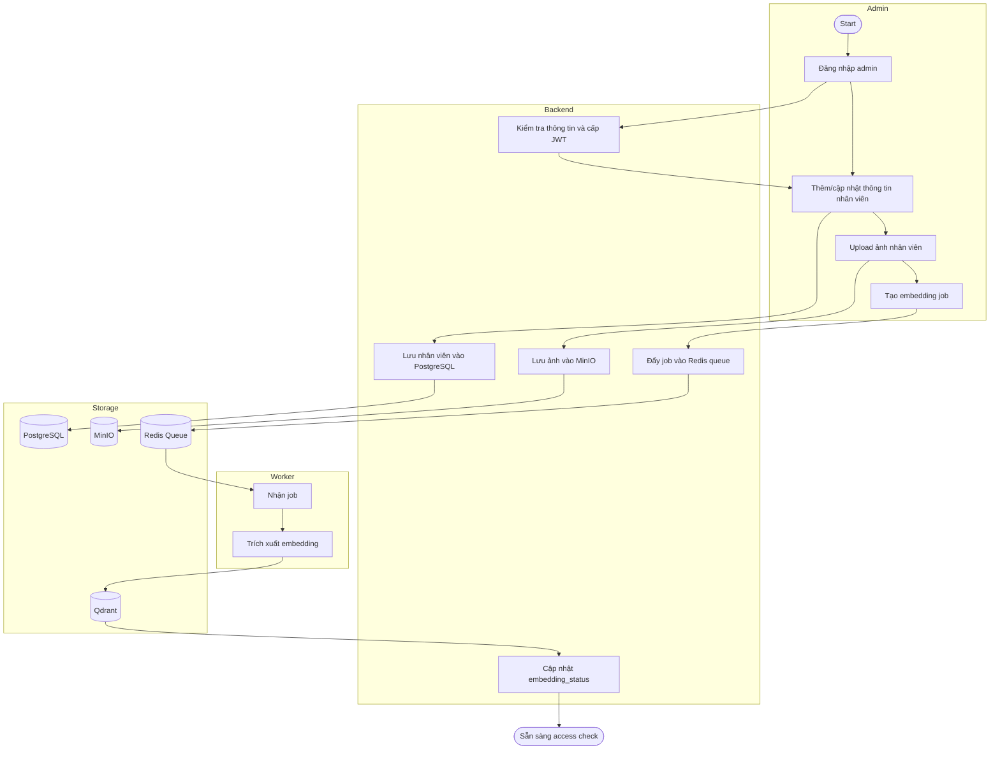

# Admin embedding flow

```mermaid
flowchart TB
    subgraph Admin
        A([Start]) --> B[Đăng nhập admin]
        B --> D[Thêm/cập nhật thông tin nhân viên]
        D --> F[Upload ảnh nhân viên]
        F --> H[Tạo embedding job]
    end

    subgraph Backend
        C[Kiểm tra thông tin và cấp JWT]
        E[Lưu nhân viên vào PostgreSQL]
        G[Lưu ảnh vào MinIO]
        I[Đẩy job vào Redis queue]
        L[Cập nhật embedding_status]
    end

    subgraph Worker
        J[Nhận job]
        K[Trích xuất embedding]
    end

    subgraph Storage
        P[(PostgreSQL)]
        M[(MinIO)]
        R[(Redis Queue)]
        Q[(Qdrant)]
    end

    B --> C --> D --> E --> P
    F --> G --> M
    H --> I --> R --> J --> K --> Q --> L
    L --> Z([Sẵn sàng access check])
```
