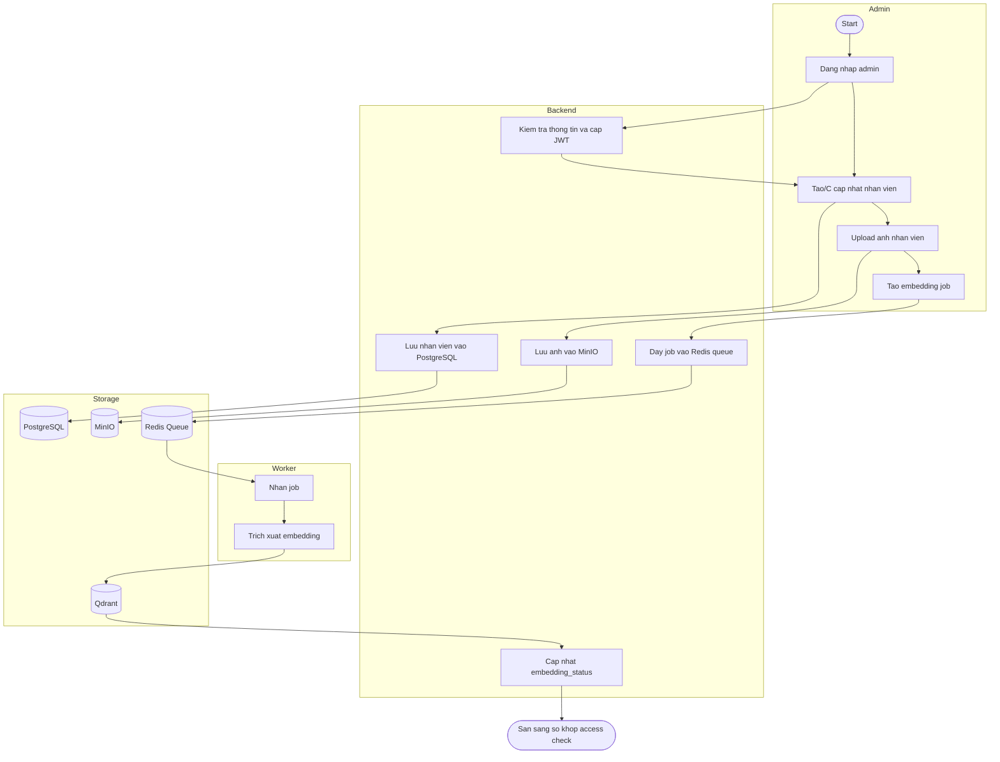

# Admin embedding flow

```mermaid
flowchart TB
    subgraph Admin
        A([Start]) --> B[Dang nhap admin]
        B --> D[Tao/C cap nhat nhan vien]
        D --> F[Upload anh nhan vien]
        F --> H[Tao embedding job]
    end

    subgraph Backend
        C[Kiem tra thong tin va cap JWT]
        E[Luu nhan vien vao PostgreSQL]
        G[Luu anh vao MinIO]
        I[Day job vao Redis queue]
        L[Cap nhat embedding_status]
    end

    subgraph Worker
        J[Nhan job]
        K[Trich xuat embedding]
    end

    subgraph Storage
        P[(PostgreSQL)]
        M[(MinIO)]
        R[(Redis Queue)]
        Q[(Qdrant)]
    end

    B --> C --> D --> E --> P
    F --> G --> M
    H --> I --> R --> J --> K --> Q --> L
    L --> Z([San sang so khop access check])
```
